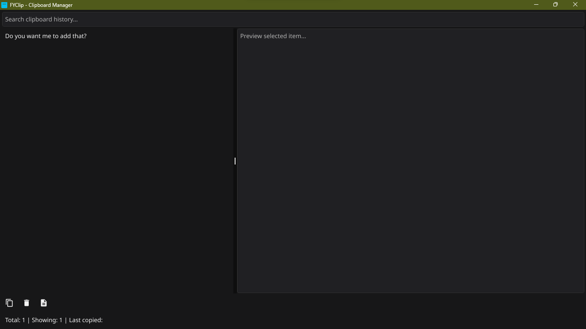

# FyClip - Advanced Clipboard Manager

A powerful, cross-platform clipboard manager built with Go and Fyne that automatically tracks your clipboard history, provides instant search, and persists data between sessions. Now with **image support** and **pinning** for favorite items.



## ✨ Features

### Core Functionality

- **🔄 Automatic Clipboard Monitoring**: Captures text and images from clipboard in real-time (500ms intervals)
- **💾 Persistent Storage**: Saves clipboard history to JSON file and restores on restart
- **🔍 Real-time Search**: Instantly filter clipboard history with live search
- **📋 One-click Copy**: Select any historical item (text or image) and copy it back to clipboard
- **🗑️ Item Management**: Delete individual items or clear entire history
- **📊 Live Statistics**: Shows total items, filtered items, and last copied time in the status bar

### Smart Features

- **🚫 Duplicate Prevention**: Automatically prevents duplicate entries, moves existing items to top
- **📌 Pinning Support**: Pin frequently used items to keep them at the top of the history
- **🖼 Image Support**: Detects images copied to clipboard and provides a preview
- **💡 Memory Management**: Limits history to 1000 items to prevent memory bloat
- **📏 Content Filtering**: Ignores empty clipboard and very large content (>10KB)
- **🎨 Smart Display**: Truncates long text, replaces newlines for better readability, and shows image thumbnails
- **⚡ Performance Optimized**: Asynchronous file operations, non-blocking UI updates
- **🔒 Thread-Safe**: Proper synchronization for reliable multi-threaded operation

### User Interface

- **🎯 Clean Design**: Intuitive layout with search bar, list view, and action toolbar
- **🖼️ Image Preview Panel**: Quickly see copied images or text before using
- **📌 Pinning Controls**: Easily pin/unpin items from history list
- **🎨 Dark/Light Theme Support**: Adjustable theme for better visual comfort
- **📱 Responsive Layout**: Adapts to different window sizes
- **⌨️ Keyboard Friendly**: Navigate list and search efficiently

---

## 🚀 Quick Start

### Prerequisites

- Go 1.19 or later
- Git (for cloning)

### Installation

#### Option 1: Download Pre-built Binaries

Visit the [Releases](https://github.com/Sarwarhridoy4/FyClip---Advanced-Clipboard-Manager/releases) page and download the appropriate binary for your platform.

#### Option 2: Build from Source

```bash
# Clone the repository
git clone https://github.com/Sarwarhridoy4/FyClip---Advanced-Clipboard-Manager.git
cd FyClip---Advanced-Clipboard-Manager

# Download dependencies
go mod tidy

# Run directly
go run main.go

# Or build executable
fyne install -icon icon.png

# Release package
fyne package
```

---

## 🔧 Build Instructions

### Windows

```bash
GOOS=windows GOARCH=amd64 go build -ldflags="-H windowsgui" -o fyclip.exe
```

### macOS

```bash
GOOS=darwin GOARCH=amd64 go build -o fyclip-mac-intel
GOOS=darwin GOARCH=arm64 go build -o fyclip-mac-apple
```

### Linux

```bash
GOOS=linux GOARCH=amd64 go build -o fyclip-linux
GOOS=linux GOARCH=386 go build -o fyclip-linux-32
GOOS=linux GOARCH=arm GOARM=7 go build -o fyclip-linux-arm
GOOS=linux GOARCH=arm64 go build -o fyclip-linux-arm64
```

---

## 📁 File Structure

```
FyClip---Advanced-Clipboard-Manager/
├── main.go              # Main application code
├── icon.png             # Application icon (optional)
├── go.mod               # Go module dependencies
├── go.sum               # Dependency checksums
├── README.md            # This file
├── screenshot.png       # Application screenshot
└── builds/              # Built binaries (after running build script)
```

---

## 🎯 Usage

1. **Launch the Application**: Run the executable or use `go run main.go`
2. **Automatic Monitoring**: Start copying text or images - they will appear in the history automatically
3. **Search**: Use the search bar to filter clipboard items
4. **Copy Items**: Select an item from the list and click "Copy Selected"
5. **Pin/Unpin Items**: Pin important items to keep them at the top
6. **Delete or Clear**: Manage items using "Delete Selected" or "Clear All"
7. **Preview**: Check text or image preview before copying
8. **View Statistics**: Status bar shows total items, filtered items, and last copied time

---

## ⚙️ Configuration

- **Custom Icon**: Place `icon.png` in the same directory to use a custom icon
- **Memory Limits**: Max 10KB per item, max 1000 items
- **Monitoring Interval**: 500ms

---

## 🐛 Troubleshooting

- **Application won't start**: Ensure Go 1.19+ and run `go mod tidy`
- **Clipboard not monitored**: Linux may require additional permissions
- **Icon not showing**: Verify `icon.png` exists and is valid
- **Performance issues**: Clear history if too large

---

## 🤝 Contributing

1. Fork the repository
2. Create a feature branch: `git checkout -b feature-name`
3. Commit changes: `git commit -am 'Add feature'`
4. Push: `git push origin feature-name`
5. Submit a pull request

---

## 📞 Support

- **GitHub Issues**: [https://github.com/Sarwarhridoy4/FyClip---Advanced-Clipboard-Manager/issues](https://github.com/Sarwarhridoy4/FyClip---Advanced-Clipboard-Manager/issues)
- **Discussions**: [https://github.com/Sarwarhridoy4/FyClip---Advanced-Clipboard-Manager/discussions](https://github.com/Sarwarhridoy4/FyClip---Advanced-Clipboard-Manager/discussions)

---

**FyClip** - Making clipboard management effortless across all platforms! 🚀

# Change Log

## [1.3.0] - 2025-09-17

### Added

- **🖼️ Cross-Platform Image Support**: Full image clipboard handling for Linux, Windows, and macOS using `golang.design/x/clipboard` library.
- **📌 Enhanced Pinning**: Pin button now appears first in list items for easier access. Pinned items are visually distinct and protected from deletion.
- **🛡️ Pin Protection**: Pinned items cannot be deleted until unpinned first, with user notification for attempted deletions.
- **🧹 Preview Clearing**: Automatically clears the preview panel (text and image) after deleting an item or clearing history.

### Changed

- **UI Layout**: Pin icon repositioned before type icon in history list for improved usability.
- **Duplicate Detection**: Improved deduplication for images using SHA256 hashing to prevent identical image entries.
- **Preview Handling**: Better image size approximation and error handling in preview display.

### Fixed

- **Clipboard Crashes**: Resolved Windows-specific clipboard access errors when handling images.
- **Preview Persistence**: Fixed stale preview content remaining after item deletion.
- **Thread Safety**: Ensured all UI updates (including preview clearing) run on the main thread using `fyne.Do`.

### Notes

- Version 1.3.0 focuses on robust image support across all platforms and user-requested UX improvements for pinning and preview management. Requires `go get golang.design/x/clipboard` for building.

## [1.2.0] - 2025-09-15

### Added

- **System Tray Support**: FyClip now has a tray icon with menu options:
  - **Show**: Restore the main window.
  - **Enable/Disable AutoStart**: Toggle automatic startup on system boot.
  - **Quit**: Exit the application completely.
- **Auto-Hide on Close**: Closing the window now hides the app to the system tray instead of quitting.
- **Cross-Platform Auto-Start**: Automatically start FyClip on login for Linux, Windows, and macOS.
- **System Theme Awareness**: Retains the user’s system dark/light theme for the app.

### Changed

- Main window no longer exits the app on close; now it hides to tray.
- Updated tray menu dynamically reflects the AutoStart state.

### Fixed

- Minor UI refresh issues when selecting or updating clipboard items.

### Notes

- Version 1.2.0 enhances background usability by integrating system tray features and auto-start capabilities while keeping clipboard monitoring fully functional.
