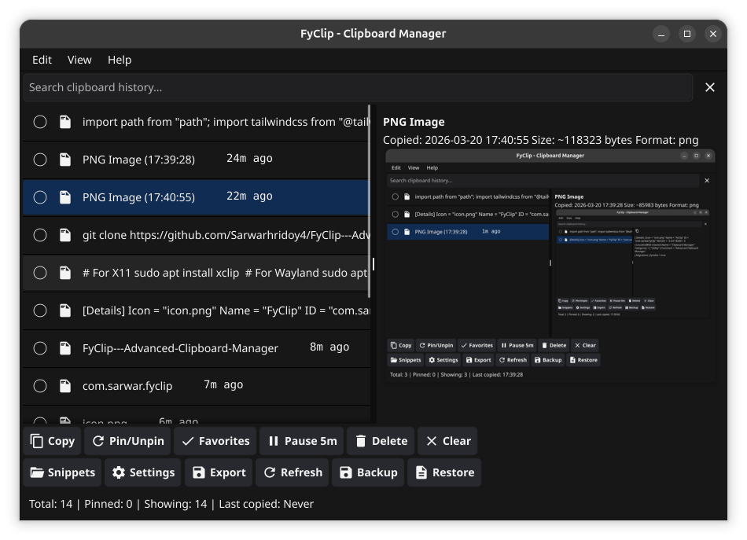
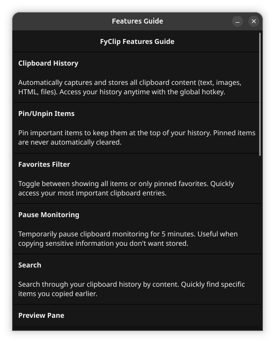
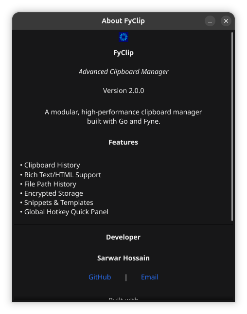

# FyClip - Advanced Clipboard Manager

A modular, high-performance clipboard manager built with Go and Fyne v2.7+.

**Current Version**: 2.1.3

## Features

- 📋 **Clipboard History**: Automatically saves text, images, HTML, and files
- 📌 **Pin Items**: Keep important items at the top
- ⭐ **Favorites View**: Toggle pinned-only view instantly
- 🔍 **Enhanced Search**: Regex, case-sensitive, and fuzzy matching
- ❌ **Clear Search**: One-click reset for the search box
- 🖼️ **Image Support**: Preview and save clipboard images
- 📝 **HTML Support**: Capture and preserve HTML formatting
- 📁 **File History**: Track files copied from file manager
- 📤 **Unified Export**: Export selected text or images from one action
- 📝 **Markdown Preview**: Markdown content renders correctly in preview pane
- 🕒 **Relative Time + Reuse Count**: List rows show recency and copy frequency
- 💾 **Persistent Storage**: History saved across sessions
- 🔒 **Encrypted Storage**: AES-256-GCM encryption at rest
- ☁️ **Encrypted Backup**: Password-protected backup and restore
- 📝 **Snippets**: Save and expand text templates
- 🚀 **AutoStart**: Launch on system startup
- ⏸️ **Pause Capture**: Pause monitoring for 5 minutes from toolbar/tray
- 🎨 **Theme Support**: Light, Dark, and System theme modes with easy switching
- 🎨 **Modern UI**: Dark theme with responsive design
- ⚡ **Performance**: Debounced updates, async operations, O(1) lookups
- 🐧 **Linux Packaging**: Official Fyne Linux package pipeline for `.deb` and `.AppImage`
- 🔒 **Thread-Safe**: Proper concurrency handling
- 🛡️ **Sensitive Data Detection**: Auto-detect credit cards, SSN, API keys
- 📦 **Bulk Operations**: Multi-select items for batch delete/pin/unpin
- 🏷️ **Smart Categories & Tags**: Auto-categorize content (Links, Code, Contacts, etc.)
- ⌨️ **Enhanced Keyboard Navigation**: Arrow keys, Enter, Delete, Escape, Space, Home/End, F1
- ⬆️ **Auto Update**: Check for and install updates from GitHub releases

## Screenshots







## Improvements

### Recently Implemented

- ✅ **Auto Update**: Check for and install updates from GitHub releases
  - Terminal: `fyclip --check-update` and `fyclip --update`
  - UI: Help → Check for Updates
- ✅ **HTML Preview**: Auto-detect HTML content and display as code block in preview
  - Fast detection: Any content starting with `<` followed by a letter is detected as HTML
  - HTML content displays as code block in preview pane

- ✅ **Theme Support**: Light, Dark, and System theme modes with centered popup selection
- ✅ **Bulk Operations**: Multi-select with checkboxes, batch delete/pin/unpin actions
- ✅ **Smart Categories**: Auto-detect content types (Links→Links, Code snippets→Code, Emails→Contacts, Phone numbers→Contacts)
- ✅ **Tags**: Add custom tags to organize clipboard items
- ✅ **Enhanced Keyboard Navigation**: Arrow keys, Enter, Delete, Escape, Space, Home/End, F1
- ✅ **Quick Panel**: Global hotkey quick access popup for fast paste (Ctrl+Shift+V)
- ✅ **Snippets/Templates**: Create text templates with variables ({{date}}, {{time}}, {{clipboard}})
- ✅ **Pattern Exclusion**: Regex, app, and size-based content filtering
- ✅ **Hash Maps**: O(1) duplicate detection and item lookup
- ✅ **Encrypted Backup**: Password-protected backup with AES-256-GCM
- ✅ **Rich Text/HTML**: Capture and preserve HTML clipboard content
- ✅ **File History**: Track files copied from file manager
- ✅ **Enhanced Search**: Regex, case-sensitive, and fuzzy matching
- ✅ **Sensitive Data**: Auto-detect and handle sensitive content
- ✅ **Structured Logging**: slog-based logging with file rotation
- ✅ **Graceful Shutdown**: Context-based shutdown with hooks
- ✅ **System Tray**: Recent items submenu, Clear History action
- ✅ **Preview Enhancements**: JSON pretty-printing, file info display
- ✅ **Test Coverage**: Improved test assertions to eliminate linter warnings

### Performance Snapshot (internal/clipboard benchmarks)

Run command:

```bash
go test -bench 'Benchmark(UpdateFilteredSearch1000|AddItemWithDuplicateScan1000|StorageSave1000)$' -benchmem ./internal/clipboard
```

Latest measured deltas:
- `BenchmarkUpdateFilteredSearch1000`: `604006 ns/op` -> `37772 ns/op` (~16x faster)
- `BenchmarkUpdateFilteredSearch1000` allocations: `1020 allocs/op` -> `0 allocs/op`
- `BenchmarkAddItemWithDuplicateScan1000`: `966.1 ns/op` -> `1523 ns/op` (small regression, low absolute cost)
- `BenchmarkStorageSave1000`: raw `Storage.Save` micro-benchmark unchanged/slower, but save requests are now coalesced in runtime manager flow

### Planned Enhancements

- Virtualized list rendering for large history
- Lazy loading for images
- Memory optimization with compression

## Project Structure

```
fyclip/
├── main.go                      # Application entry point
├── Makefile                     # Build automation
├── go.mod                       # Go module dependencies
├── icon.png                     # Application icon
├── internal/
│   ├── app/
│   │   └── app.go              # App initialization
│   ├── clipboard/
│   │   ├── item.go             # Clipboard item types (Text, Image, HTML, File)
│   │   ├── manager.go          # Core manager logic
│   │   ├── monitor.go          # Clipboard monitoring
│   │   ├── native.go           # Platform clipboard ops
│   │   ├── storage.go          # Persistence layer
│   │   ├── snippet.go          # Snippet management
│   │   ├── exclusion.go        # Pattern exclusion rules
│   │   ├── search.go           # Enhanced search
│   │   ├── backup.go           # Encrypted backup
│   │   └── sensitive.go        # Sensitive data handling
│   ├── config/
│   │   └── config.go           # Configuration management
│   ├── errors/
│   │   └── errors.go           # Custom error types
│   ├── logger/
│   │   └── logger.go           # Structured logging
│   ├── ui/
│   │   ├── window.go           # Main window
│   │   ├── list.go             # History list
│   │   ├── preview.go          # Preview pane
│   │   ├── toolbar.go          # Action buttons
│   │   ├── search.go           # Search bar
│   │   ├── status.go           # Status bar
│   │   └── dialogs.go          # Dialogs & utilities
│   ├── platform/
│   │   ├── autostart.go        # Autostart interface
│   │   ├── autostart_linux.go  # Linux implementation
│   │   ├── autostart_windows.go # Windows implementation
│   │   └── autostart_darwin.go # macOS implementation
│   └── tray/
│       └── tray.go             # System tray
└── README.md
```

## Requirements

- Go 1.21 or later
- Fyne v2.5+
- For Linux:
  - X11: `xclip` package
  - Wayland: `wl-clipboard` package
- For Windows: No additional dependencies
- For macOS: No additional dependencies

## Installation

### 1. Clone the repository

```bash
git clone https://github.com/Sarwarhridoy4/FyClip---Advanced-Clipboard-Manager.git
cd FyClip---Advanced-Clipboard-Manager
```

### 2. Install dependencies

```bash
go mod download
```

### 3. Build

```bash
make build
# or
go build -o fyclip
```

### 4. Run

```bash
./fyclip
```

## Linux Dependencies

### Ubuntu/Debian

```bash
# For X11
sudo apt install xclip

# For Wayland
sudo apt install wl-clipboard
```

### Arch Linux

```bash
# For X11
sudo pacman -S xclip

# For Wayland
sudo pacman -S wl-clipboard
```

### Fedora

```bash
# For X11
sudo dnf install xclip

# For Wayland
sudo dnf install wl-clipboard
```

## Building for Release

### Linux Debian + AppImage (Recommended)

Use the project script, which now follows Fyne's official Linux packaging flow (`fyne package --os linux`) and then builds:
- Debian package: `dist/fyclip_<version>_<arch>.deb`
- AppImage: `dist/fyclip_<version>_<arch>.AppImage`

```bash
./build.sh
# or pass explicit version
./build.sh 1.6.0
```

Requirements for the script:
- `go`
- `fyne` CLI
- `dpkg-deb`
- `appimagetool`
- `tar`

Packaging process used by `build.sh`:
1. Run Fyne official Linux packaging:
   - `fyne package --os linux --release --name fyclip --icon icon.png`
   - Generates `fyclip.tar.xz`
2. Extract Fyne package payload and reuse its generated Linux assets:
   - Binary in `usr/bin` or `usr/local/bin`
   - Desktop entry in `usr/share/applications` or `usr/local/share/applications`
   - Icon in `usr/share/pixmaps` or `usr/local/share/pixmaps`
3. Build Debian package (`.deb`) from that payload via `dpkg-deb`
4. Build AppImage (`.AppImage`) from the same payload via `appimagetool`
5. Place final artifacts in `dist/`

### Using Makefile

```bash
# Build for current platform
make build

# Build for all platforms
make build-all

# Run tests
make test

# Package for distribution
make package

# Create release
make release
```

### Fyne Native Packaging

Package using Fyne directly:

```bash
# Linux tar package (official Fyne output)
fyne package --os linux --release --name fyclip --icon icon.png

# Windows installer
fyne package --os windows --release --name fyclip --icon icon.png

# macOS app bundle / dmg
fyne package --os darwin --release --name fyclip --icon icon.png
```

### Cross-Platform Build

Use `fyne-cross` for easy cross-compilation:

```bash
# Install fyne-cross
go install github.com/fyne-io/fyne-cross@latest

# Build for Linux
fyne-cross linux -arch=amd64

# Build for Windows
fyne-cross windows -arch=amd64

# Build for macOS
fyne-cross darwin -arch=amd64
```

## Usage

### Keyboard Shortcuts

- **↑/↓ (Arrow Keys)**: Navigate through clipboard items
- **Enter**: Copy selected item to clipboard
- **Delete**: Delete selected item
- **Space**: Pin/unpin selected item
- **Escape**: Clear search / Close panel
- **Home**: Go to first item
- **End**: Go to last item
- **F1**: Focus search bar
- **Ctrl+F**: Focus search bar
- **Ctrl+Shift+V**: Open quick panel

#### Bulk Selection Mode

- **Ctrl+Click**: Add/remove item from selection
- Click toolbar **Select** button to enter selection mode

### Features

1. **Pin Items**: Click the pin button or press Space to keep items at the top
2. **Search**: Type in the search bar to filter items (supports regex, case-sensitive, fuzzy)
3. **Favorites Filter**: Click "Favorites" to show pinned items only
4. **Preview**: Select an item to see full content (JSON pretty-printed automatically)
5. **Export**: Click "Export" to save selected text or image
6. **Pause Monitoring**: Use "Pause 5m" to temporarily stop capturing
7. **History Limit**: Configure max unpinned history via toolbar settings
8. **Clear History**: Remove all unpinned items
9. **System Tray**: Minimize to tray, configure autostart/pause, access recent items
10. **Snippets**: Create and manage text templates
11. **Backup**: Create encrypted backups of your history
12. **Categories**: Auto-categorized content (Links, Code, Contacts, Images, Files, Text)
13. **Tags**: Add custom tags to organize items
14. **Theme**: Switch between Light, Dark, and System themes
15. **Bulk Operations**: Multi-select items for batch actions

### Snippets

Snippets allow you to create reusable text templates with dynamic variables. They can be accessed via the toolbar "Snippets" button.

#### Creating a Snippet

1. Click the "Snippets" button in the toolbar
2. Click "Add Snippet" button
3. Fill in the details:
   - **Title**: A descriptive name (e.g., "Email Signature")
   - **Content**: The template text with optional variables
   - **Abbreviation** (optional): A short trigger word for quick access (e.g., "sig")
   - **Category** (optional): Group snippets by category

#### Using Variables

Snippets support the following template variables that are automatically expanded when used:

| Variable | Description | Example Output |
|----------|-------------|----------------|
| `{{date}}` | Current date | 2026-03-20 |
| `{{time}}` | Current time | 14:30:45 |
| `{{datetime}}` | Full date and time | 2026-03-20 14:30:45 |
| `{{year}}` | Current year | 2026 |
| `{{month}}` | Current month (01-12) | 03 |
| `{{day}}` | Current day (01-31) | 20 |
| `{{clipboard}}` | Current clipboard content | (varies) |

#### Example Snippet

```
Title: Email Signature
Abbreviation: sig
Category: General
Content:
Best regards,
{{name}}
{{date}}
```

When used, this expands to:
```
Best regards,
John Doe
2026-03-20
```

#### Using Snippets

1. Click the "Snippets" button in the toolbar
2. Select the snippet you want to use
3. Click "Use" or double-click to copy the expanded content to clipboard
4. The template variables will be replaced with current values

## Configuration

Settings are automatically saved to:

- **Linux**: `~/.fyclip/`
- **Windows**: `%USERPROFILE%\.fyclip\`
- **macOS**: `~/.fyclip/`

## Architecture Highlights

### Modular Design

- **Separation of Concerns**: Each module has a single responsibility
- **Clean Interfaces**: Well-defined APIs between components
- **Testability**: Easy to unit test individual modules

### Performance Optimizations

- **Debounced Updates**: UI updates are batched (50ms debounce)
- **Coalesced Saves**: History persistence requests are serialized and debounced (250ms)
- **O(1) Lookups**: Hash maps for duplicate detection and item access
- **Efficient Filtering**: Search avoids repeated lowercasing and minimizes allocation churn
- **Object Pool**: sync.Pool for Item reuse to reduce GC pressure
- **Regex Cache**: Compiled regex patterns cached for faster repeated searches
- **Fuzzy Search**: Optimized subsequence matching with reduced allocations
- **Thread-Safe**: Proper mutex usage throughout
- **Selection Fast Path**: Selecting list items avoids redundant full-window refreshes
- **Duplicate Promotion**: Existing duplicates move to latest with notification

### Thread Safety

- All shared state protected with `sync.RWMutex`
- Proper locking hierarchy to prevent deadlocks
- Channel-based communication for cross-goroutine updates

### Security

- **AES-256-GCM Encryption**: All data encrypted at rest
- **Sensitive Data Detection**: Auto-detect credit cards, SSN, API keys
- **Secure Wipe**: Clear sensitive data from memory
- **Password-Protected Backups**: Optional encryption for backups

## Development

### Adding New Features

1. **New clipboard item types**: Extend `clipboard/item.go`
2. **UI components**: Add to `internal/ui/`
3. **Platform features**: Implement in `internal/platform/`

### Code Style

- Follow Go conventions
- Use meaningful variable names
- Add comments for exported functions
- Keep functions small and focused

### Makefile Targets

```bash
make help    # Show available targets
make build   # Build the application
make test    # Run tests
make lint    # Run linter
make clean   # Clean build artifacts
```

## Troubleshooting

### Clipboard not working on Linux

Make sure you have the required clipboard tools:

```bash
# Check for xclip
which xclip

# Check for wl-paste
which wl-paste
```

### Build errors

Make sure you have the latest Fyne dependencies:

```bash
go get -u fyne.io/fyne/v2@latest
go mod tidy
```

## Contributing

Contributions are welcome! Please:

1. Fork the repository
2. Create a feature branch
3. Make your changes
4. Submit a pull request

## Changelog

See [CHANGELOG.md](CHANGELOG.md) for a history of changes.

## License

MIT License - See LICENSE file for details

## Author

**Sarwar Hossain**

- Email: sarwarhridoy4@gmail.com
- GitHub: [@Sarwarhridoy4](https://github.com/Sarwarhridoy4)

## Acknowledgments

- Built with [Fyne](https://fyne.io/) - Cross-platform GUI toolkit
- Uses [golang.design/x/clipboard](https://github.com/golang-design/clipboard) for clipboard access
